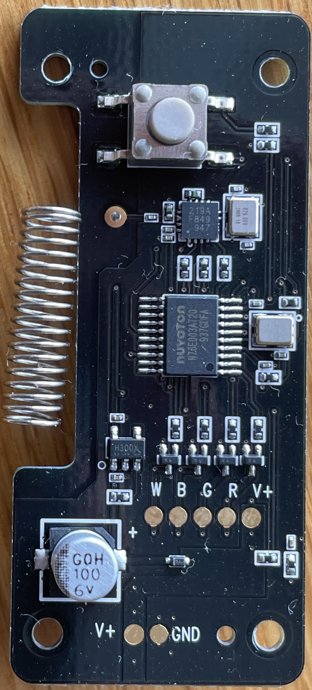
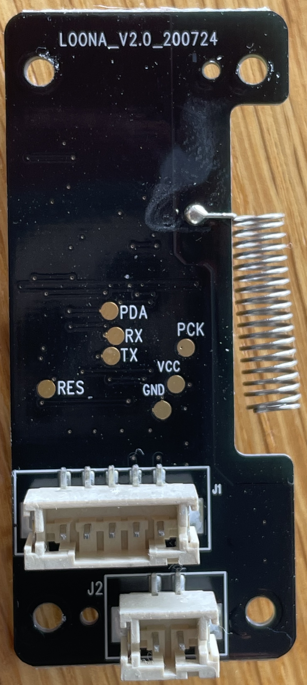

# loona-lightstick
Explorations in reverse-engineering the Loona light stick electronics.

## Background

At the 2022 LOONAVERSE: FROM concert all of light sticks in the arena were syncronised to the same colour. In the manual there is a section that says:

> Central Control Mode: Capable of functioning by central control at show without pressing the button, Normal mode becomes inoperative when this mode is on.

So let's investigate further!

## Goals

- Make a transmitter that can change the colour of the lightstick like they do at shows.
- Syncronise lightstick colour to a performance.
- Make an app to control the colour.

## Main board

- EMC: R-R-OBJ-LOONA01V
- Manufacturer: Shenzhen OBJECT Technology Co., Ltd.
- Board reference: LOONA_V2.0_200724
- Microcontroller: Nuvoton N76E003AT20 (8051 core)
- Radio receiver: CMOSTEK CMT2219A (sub-GHz OOK/FSK)
- Antenna: helix spring antenna, frequency TBC
- Power supply: 3 x AAA (4.5V nominal)
- Voltage regulator: AnaSem VRH3001NTX (3.00V)
- Output: 4ch LED (RGBW), common anode

Test points:
- PDA: radio data (bidirectional)
- PCK: radio clock (microcontroller output, radio input)
- TX/RX: connected to microcontroller serial port 0 (pins 2 and 3)
- RES: microcontroller reset (pin 4)
- VCC: regulated logic voltage (3.00V)
- V+: battery positive and LED anode
- W/B/G/R: LED channel outputs from the drivers
